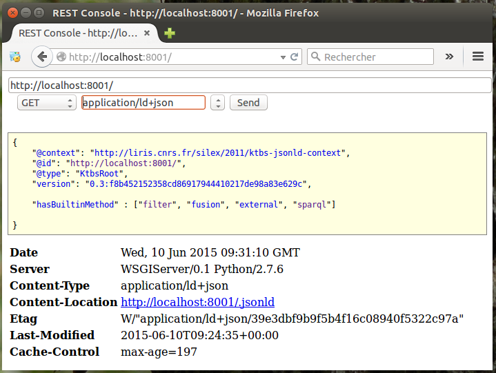

Installing a local kTBS
=======================

Make sure you have read and executed :ref:`common-prerequisites` instructions, i.e installed **python developer files** and **virtualenv** system packages.

Create the Python vitual environment
++++++++++++++++++++++++++++++++++++

Let us now create a Python virtual environment for kTBS. Once the ``python-virtualenv`` package has been installed, you have a ``virtualenv`` command to create your isolated Python virtual environment.

.. code-block:: bash

    $ cd /home/user

    $ virtualenv ktbs-env
    New python executable in ktbs-env/bin/python
    Installing distribute.............................................................................................................................................................................................done.
    Installing pip...............done.

The virtual environnement is then activated by **sourcing** the ``activate`` script. Once it is done, you can notice that the Python interpreter used is the virtual environment Python interpreter.

.. code-block:: bash
    :emphasize-lines: 6

    user@mymachine:/home/user$ cd ktbs-env/

    user@mymachine:/home/user/ktbs-env$ source bin/activate

    (ktbs-env)user@mymachine:/home/user/ktbs-env$ which python
    /home/user/ktbs-env/bin/python

You leave the virtual environment by running the ``deactivate`` command.

.. code-block:: bash

    (ktbs-env)user@mymachine:/home/user/ktbs-env$ deactivate
    user@mymachine:/home/user/ktbs-env#

Install kTBS itself
+++++++++++++++++++

In the activated Python virtual environment, use the **pip** [1]_ command simply as below, it will install kTBS and its dependencies from the `PyPI <https://pypi.python.org/pypi>`_ [2]_ repository.

.. code-block:: bash
    :emphasize-lines: 1

    (ktbs-env)user@mymachine:/home/user/ktbs-env$ pip install ktbs
    Downloading/unpacking ktbs
      Downloading kTBS-0.3.tar.gz (126Kb): 126Kb downloaded
      Running setup.py egg_info for package ktbs
        /usr/lib/python2.7/distutils/dist.py:267: UserWarning: Unknown distribution option: 'console'
          warnings.warn(msg)
        
    Downloading/unpacking rdflib==4.1.2 (from ktbs)
    ...

Update kTBS
~~~~~~~~~~~

If you further want to update kTBS to the latest version, just type:

.. code-block:: bash

    (ktbs-env)user@mymachine:/home/user/ktbs-env$ pip install ktbs -U

Testing the installed kTBS
++++++++++++++++++++++++++

Once installed, just run the **ktbs** command, it launches an internal HTTP server on the 8001 port (by default).

.. code-block:: bash

    (ktbs-env)user@mymachine:/home/user/ktbs-env$ ktbs
    INFO 08/06/2015 05:20:49 PM ktbs Using IPV4
    INFO 08/06/2015 05:20:49 PM ktbs KTBS server at http://localhost:8001/

You stop kTBS with ``Ctrl-C``.

REST console
~~~~~~~~~~~~

Enter the kTBS root URL in a browser and use the built-in web interface to interact with kTBS.

Command line clients
~~~~~~~~~~~~~~~~~~~~

You can send HTTP requests to kTBS with the `wget <http://man7.org/linux/man-pages/man1/wget.1.html>`_ (or `curl <http://curl.haxx.se/docs/manpage.html>`_) command line tools, here a GET request with wget asking kTBS a response using the Turtle format.

.. code-block:: bash
    :emphasize-lines: 1

    $ wget -qO- --header="Accept: text/turtle" http://localhost:8001/

    @prefix rdf: <http://www.w3.org/1999/02/22-rdf-syntax-ns#> .
    @prefix rdfs: <http://www.w3.org/2000/01/rdf-schema#> .
    @prefix skos: <http://www.w3.org/2004/02/skos/core#> .
    @prefix xml: <http://www.w3.org/XML/1998/namespace> .
    @prefix xsd: <http://www.w3.org/2001/XMLSchema#> .

    <> a :KtbsRoot ;
        :hasBuiltinMethod :external,
            :filter,
            :fusion,
            :sparql ;
        :hasVersion "0.3" .

Make the trace bases persistent
+++++++++++++++++++++++++++++++

By default, kTBS stores the trace bases in memory, so they will not be retained after you stop kTBS.  To make the trace bases persistent, you need to **configure a repository**. 

This can be done with the ``-r`` option.

.. code-block:: bash

    (ktbs-env)user@mymachine:/home/user/ktbs-env$ ktbs -r <dirname>

A directory named ``<dirname>`` will be used to store the trace bases; if it does not exist, it will be automatically created and initialized.

.. note::

  You must *not* create the directory for the store; if the directory already exists, kTBS will assume that it is correctly initialized, and fail if it is not the case (*e.g.* if it is empty).

kTBS help
+++++++++

There are a number of other options for configuring kTBS; to display them with their documentation, type.

.. code-block:: bash

    (ktbs-env)user@mymachine:/home/user/ktbs-env$ ktbs --help

    Usage: ktbs [options]

    HTTP-based Kernel for Trace-Based Systems

    Options:
      -h, --help            show this help message and exit
      -H HOST_NAME, --host-name=HOST_NAME
      -p PORT, --port=PORT  
      -b BASE_PATH, --base-path=BASE_PATH
      -r REPOSITORY, --repository=REPOSITORY
                            the filename/identifier of the RDF database (default:
                            in memory)
      -c CONFIGFILE, --configfile=CONFIGFILE
      -n NS_PREFIX, --ns-prefix=NS_PREFIX
                            a namespace prefix declaration as 'prefix:uri'
      -P PLUGIN, --plugin=PLUGIN
                            loads the given plugin

      Advanced options:
      ...

.. _ktbs-configuration-file:

kTBS configuration file
+++++++++++++++++++++++

If you use a regular set of configuration parameters, you may be interested to use a kTBS configuration file.

.. code-block:: bash

    (ktbs-env)user@mymachine:/home/user/ktbs-env$ ktbs -c my-specific-options.conf

Here is kTBS configuration file example that you find in kTBS source code [3]_.

.. literalinclude:: ../../../../examples/conf/ktbs.conf
    :language: ini

.. [1] Python Package Installer

.. [2] the Python Package Index

.. [3] https://github.com/ktbs/ktbs/blob/develop/examples/conf/ktbs.conf
